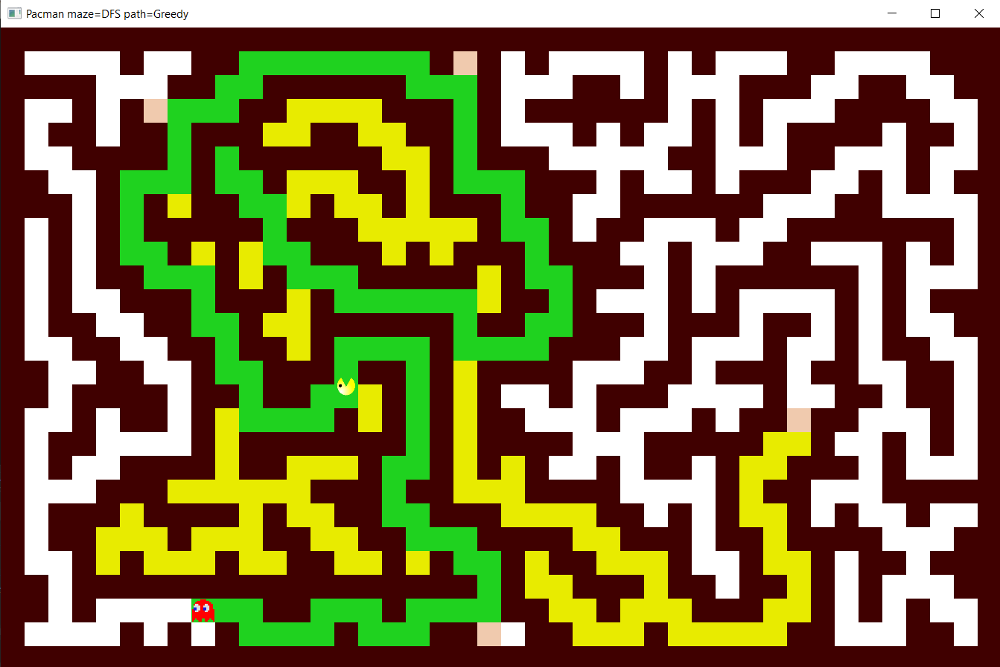

# Pacman_lab

**Game control:**

- 1 - generate new maze via DSU based algorithm
- 2 - generate new maze via DFS algorithm
- 3 - generate new maze via randomized BFS algorithm

- 4 - start pacman based on greedy path finding algorithm
- 5 - start pacman based on A* path finding algorithm

**Path finding colors:**
- green - path
- yellow - processed cells that are not on path
- lightsalmon - cells in the queue but never processed

